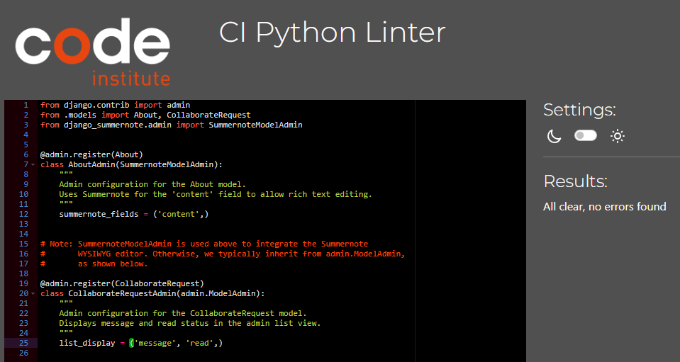
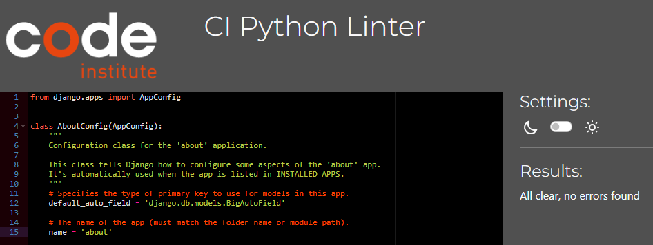
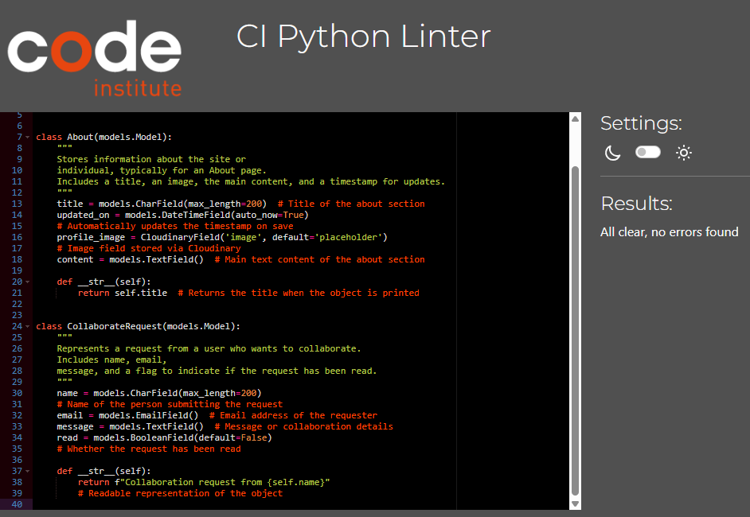
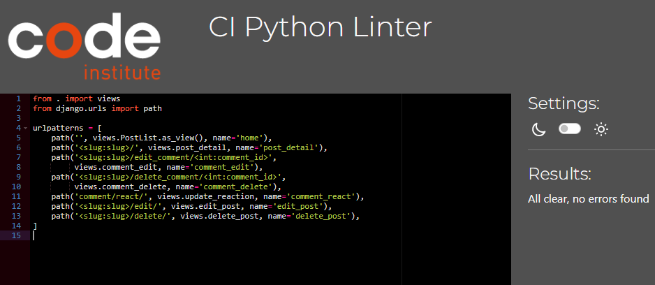
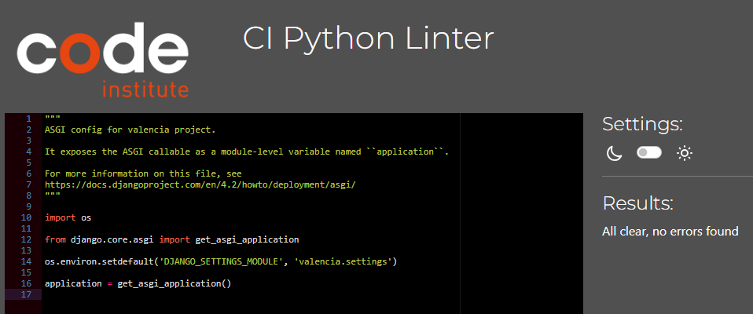
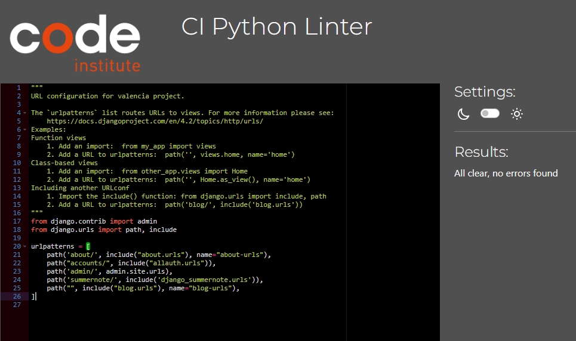
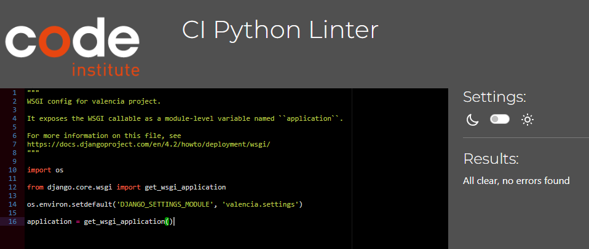

# Validations 

### (Python , HTML, CSS, JS Hint),

### Lighthouse

## Python - About 

### admin.py

### app.py 

### forms.py 

### model.py

### urls.py

### views.py

--

## Python - Blog

### admin.py

### apps.py

### forms.py

### models.py

### urls.py

### views.py

--

## Python - Valencia

### asgi.py

### settings.py

### urls.py

### wsgi.py

